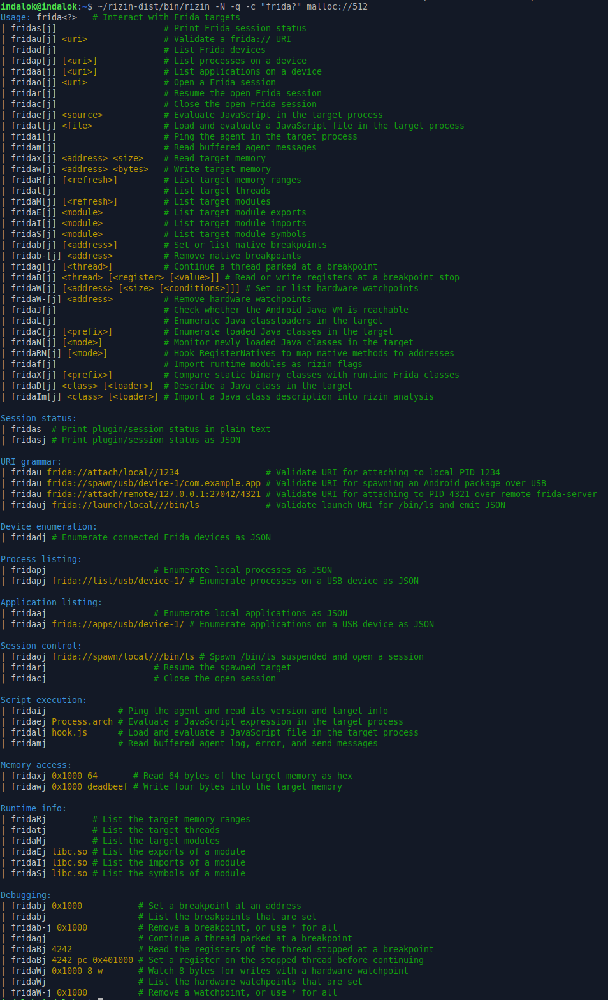
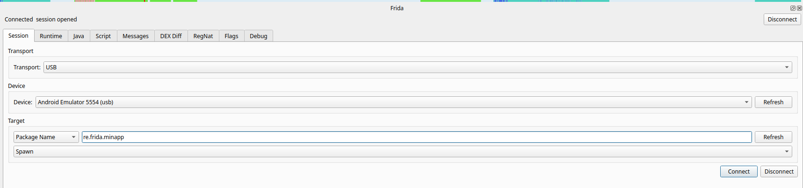
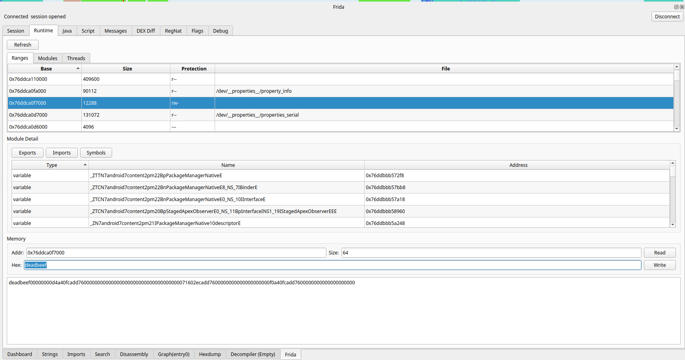
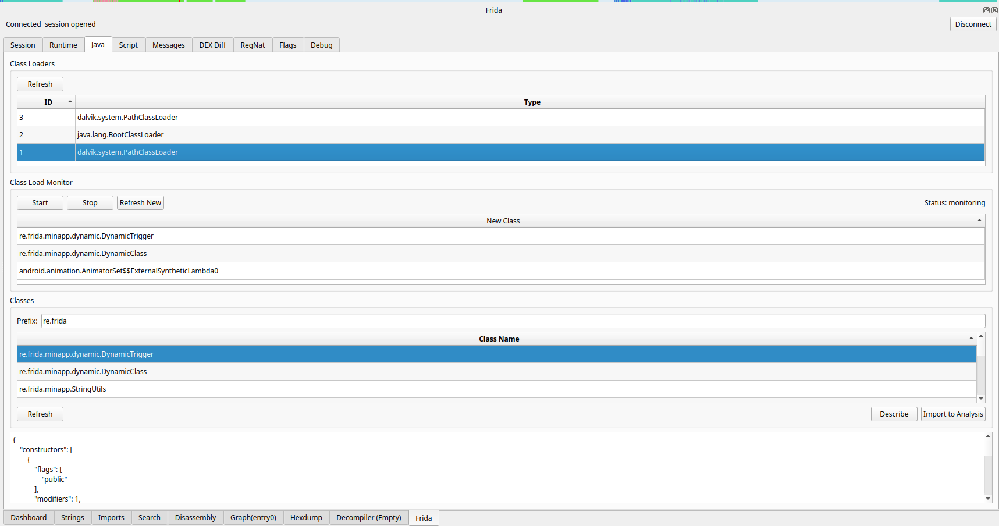
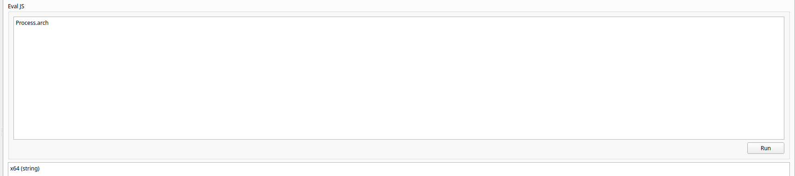
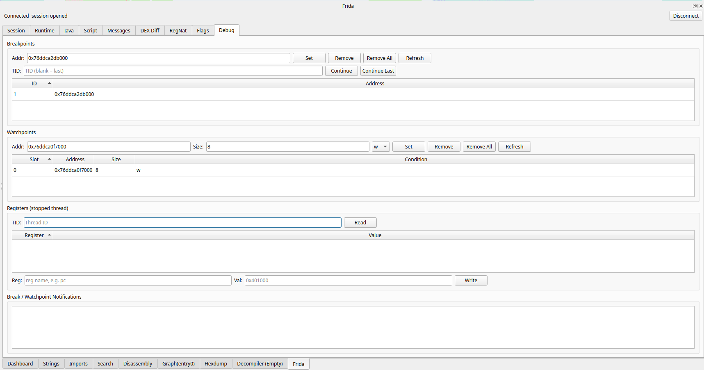

# rz-frida

Frida integration plugin for Rizin and Cutter.

The Rizin plugin provides the backend and command interface. The Cutter plugin provides a native frontend over the Rizin backend.

## Screenshots








## Features

The plugin provides:

- Rizin core plugin build support
- Cutter native plugin build support
- `frida://` URI validation
- session ownership, timeout, and cancellation primitives
- structured status and error replies
- structured device, process, and application enumeration across local, USB, and remote devices when `frida-core` is enabled
- session control across local, USB, and remote devices when `frida-core` is enabled
- script execution inside the target through an injected agent when `frida-core` is enabled
- target memory r/w through the agent when `frida-core` is enabled
- target memory range and thread listing through the agent when `frida-core` is enabled
- target module, export, import, and sym listing through the agent when `frida-core` is enabled
- native breakpoints with thread-targeted continue and register r/w at a stop through the agent when `frida-core` is enabled
- hardware watchpoints on every thread, reporting the access with its register context, through the agent when `frida-core` is enabled

## Prerequisites

- **Rizin** with its development headers, either built from source or installed
  (the plugin's meson build needs `rz_core` via pkg-config, or
  `-Drizin_build_dir` pointing at a rizin source build)
- **Cutter** for the Cutter plugin, either built from source or an extracted
  AppImage (see the Cutter plugin build section)
- **Qt 5.15+ or Qt 6** with the Widgets and Concurrent modules for the Cutter
  plugin
- **frida-core devkit** (headers plus the static library) to build with Frida
  support. Without it the plugin builds with a self-contained backend that
  answers every device and session command with a `frida_unavailable` error
- **Node.js and npm** only for agent development, to rebuild the injected
  agent bundle with `frida-compile` and to bundle `frida-java-bridge` into it
  at build time (the bundle is committed, so a plain build does not need node)
- a target to instrument, typically an **Android device running
  `frida-server`** (rooted or with an embedded frida-gadget) or a **remote
  frida-server** on the host

## Quick Start

### Rizin CLI

First, find the target process using Frida:

```
frida-ps                  # local host processes
frida-ps -U               # processes on a USB device
frida-ps -H 127.0.0.1:27042  # processes on a remote frida-server
```

Then open a rizin session and use the plugin commands:

```
rizin malloc://512              # open rizin with a small binary
fridaoj attach/local//<pid>    # attach to the local target
fridaRj                        # dump memory ranges
fridatj                        # list threads
fridaej Process.arch           # evaluate JS in the target
fridacj                        # close the session
```

The `frida` command group is available inside rizin after the plugin loads. The
`attach/local` transport targets the host, `attach/usb` a USB device, and
`attach/remote` a remote frida-server (see Targets and transports below).

### Cutter plugin

Extract a Cutter AppImage, build the plugin against it, and run Cutter:

```
./Cutter-v2.5.0-x86_64.AppImage --appimage-extract           # extract the AppImage
cmake -S plugin/cutter -B build-cutter -DCMAKE_PREFIX_PATH=./squashfs-root/usr  # configure
cmake --build build-cutter                                    # build the plugin
cmake --install build-cutter                                  # install the .so
./squashfs-root/usr/bin/cutter                                # run Cutter
```

The Frida dock appears at the top of the window. Enter the target pid in the
Session tab and click Connect.

## Architecture

The plugin has two halves that share one session model.

The **Rizin plugin** opens a session on a target device (`fridaoj`), injects a
small JS agent into the target on first use, and talks to it over a
request/response channel. Every command goes through a JSON
envelope (`ok`, `result` or `error`) and respects the session timeout and
cancellation.

The **Cutter plugin** is a dock widget frontend. It calls the rizin plugin's
C API directly through `FridaApiBridge`, and runs the blocking calls on a
background worker through `FridaTaskRunner`, so the UI ideally shouldn't freeze.
All agent replies are parsed through the same envelope validation.

# Rizin Plugin

## Build

```
meson setup build                   # configure
ninja -C build                      # compile
meson test -C build                 # run tests
```

When building against a rizin source tree instead of an installed one, point
the build at its generated headers and at the bundled sdb headers:

```
meson setup build \
  -Drizin_build_dir=/path/to/rizin/build \
  -Drizin_sdb_include_dir=/path/to/rizin/librz/util/sdb/src  # sdb headers in the source tree
ninja -C build                                                  # compile
```

## Build with Frida

The Frida library and compiler toolchain must be ABI-compatible. Configuration fails
early when `frida-core` is found but cannot be linked by the active compiler.

```
meson setup build \
  -Dfrida_core=enabled \
  -Dfrida_include_dir=/path/to/frida-core-devkit \
  -Dfrida_library=/path/to/frida-core-library   # frida-core static library
ninja -C build                                    # compile
meson test -C build                               # run tests
```

## Commands

All commands are subcommands of the `frida` group, run `frida?` in Rizin for the
built-in help with summary of each. The list below is a quick reference,
and the sections that follow explain them.

```
fridas                                              # plugin/session status, plain text
fridasj                                             # plugin/session status, JSON
fridau frida://attach/local//1234                   # validate attach URI
fridauj frida://attach/local//1234                  # validate attach URI, JSON
fridadj                                             # list connected Frida devices
fridapj                                             # list local processes
fridapj frida://list/usb/device-1/                  # list processes on a USB device
fridaaj                                             # list local applications
fridaaj frida://apps/usb/device-1/                  # list applications on a USB device
fridaoj frida://attach/local//1234                  # attach to a local pid
fridaoj frida://spawn/local///bin/ls                # spawn a local process suspended
fridaoj frida://attach/usb//com.example.app         # attach to a USB target by name
fridaoj frida://spawn/usb//com.example.app          # spawn a USB target suspended
fridaoj frida://attach/remote/127.0.0.1:27042/1234 # attach over a remote frida-server
fridarj                                             # resume a spawned target
fridacj                                             # close the open session
fridaij                                             # ping the agent
fridaej Process.arch                                # evaluate JS in the target
fridalj hook.js                                     # load and evaluate a script file
fridamj                                             # drain agent message buffer
fridaxj 0x1000 64                                   # read 64 bytes of target memory
fridawj 0x1000 deadbeef                             # write bytes to target memory
fridaRj                                             # list target memory ranges
fridatj                                             # list target threads
fridaMj                                             # list loaded modules
fridaEj libc.so                                     # list module exports
fridaIj libc.so                                     # list module imports
fridaSj libc.so                                     # list module symbols
fridabj 0x1000                                      # set a breakpoint
fridabj                                             # list breakpoints
fridab-j 0x1000                                     # remove a breakpoint
fridab-j *                                          # remove all breakpoints
fridagj                                             # continue last parked thread
fridagj 4242                                        # continue a specific thread
fridaBj 4242                                        # read registers of a parked thread
fridaBj 4242 pc 0x401000                            # write a register of a parked thread
fridaWj 0x1000 8 w                                  # set a hardware watchpoint (write, 8 bytes)
fridaWj                                             # list watchpoints
fridaW-j 0x1000                                     # remove a watchpoint
fridaW-j *                                          # remove all watchpoints
fridaJj                                             # check Java VM availability
fridaLj                                             # list classloaders
fridaCj                                             # list loaded classes
fridaCj re.frida.minapp                             # list loaded classes by prefix
fridaXj                                             # compare runtime vs static classes
fridaXj re.frida.minapp                             # compare by prefix
fridaNj                                             # list newly loaded classes since start
fridaNj start                                       # arm class load monitor
fridaNj stop                                        # disarm class load monitor
fridaRNj                                            # list RegisterNatives hook captures
fridaRNj on                                         # arm RegisterNatives hook
fridaRNj off                                        # disarm RegisterNatives hook
fridaRNj import                                     # import captured natives into analysis
fridafj                                             # import runtime modules as rizin flags
```

`fridadj`, `fridapj`, `fridaaj`, and `fridaoj` return a structured `frida_unavailable`
error when the plugin is built without `frida-core`. `fridapj` and `fridaaj` list the
local device by default, or take a `frida://` URI to select a USB or remote device.
`fridaoj` opens a session on the device named by the URI (attach, spawn, or launch on
local, USB, or remote), `fridarj` resumes a target that was spawned suspended, and
`fridacj` closes it. Closing kills a target that was spawned but never resumed and
leaves an attached or launched target running. Open, resume, and close honor the
session timeout and can be cancelled.

## Targets and transports

The `device` field of a `frida://` URI selects where the session runs. An empty device
on the `local` transport uses the host system. On the `usb` transport a device id picks
that device, and an empty device id picks the single connected device. On the `remote`
transport the device is the `host:port` of a frida-server.

`attach` accepts a numeric pid or a process name. A name is matched against the running
processes and resolved to a pid, and an unknown name returns an `invalid_target` error.
`spawn` and `launch` accept an executable path on local and remote targets or a package
identifier on USB targets. `spawn` starts the target suspended for `fridarj`, `launch`
resumes it immediately.

### Android over USB

Start `frida-server` on the device, then enumerate and open over USB:

```
fridadj                                            # list USB devices
fridaaj frida://apps/usb//                         # list apps on the USB device
fridapj frida://list/usb//                         # list processes on the USB device
fridaoj frida://spawn/usb//com.example.app         # spawn the app suspended
fridarj                                            # resume the spawned app
fridacj                                            # close the session
```

A device that is not reachable, because `frida-server` is not running or the cable is
unplugged, surfaces as a `timeout` or `internal_error` carrying the message from
`frida-core`. An unknown package or process name surfaces as an `invalid_target` error.

The example package `re.frida.minapp` used as an example here, is a small test
application, available at <https://t.me/rzfrida/25>.

### Remote frida-server

Start `frida-server -l 0.0.0.0:27042` on the host, then dial it from the listing or
session commands:

```
fridapj frida://list/remote/127.0.0.1:27042/       # list processes on the remote host
fridaoj frida://attach/remote/127.0.0.1:27042/1234  # attach to pid 1234 remotely
```

The remote transport connects to a plain frida-server. TLS and token authenticated
portals are not wired up.

## Script execution

Once a session is open, the plugin injects a small agent into the target and talks to it
over a request/response channel. The agent is loaded on first use, so the script cmds
work directly after `fridaoj` w/o a separate load step.

```
fridaij                          # ping the agent, get platform/arch/ptrsize
fridaej Process.arch             # evaluate JS in the target, return value and type
fridalj /path/to/hook.js         # load and eval a script file from disk
fridamj                          # drain the agent message buffer, return JSON array
```

`fridaij` pings the agent and returns its ver and the target platform, arch, and
ptr size, a quick check that the host-agent channel is alive. `fridaej` evals a
JS expression inside the target and returns its val and type. `fridalj` reads a
script from a file and evals it same way, for instrumentation too large for the
cmd line. Each request respects the session timeout and can be interrupted with Ctrl-C.

Not every msg from the agent is a reply. Console o/p, uncaught script errors, and
unsolicited `send()` notifs are buffered per session in a bounded queue that drops the
oldest entry when full and counts how many it dropped. `fridamj` drains that buffer as a JSON
array and clears it. Binary data attached to a `send()` is carried through as base64 with its
byte length.

## Memory

`fridaxj` reads a block of target memory and returns the bytes as a hex string. `fridawj`
writes a hex byte string into target memory and returns the number of bytes written. Both
load the agent on first use, take an addr that rizin evals (so expressions and symbols
work), and are bounded by the `frida.mem.max` config.

```
fridaxj 0x1000 64           # read 64 bytes at 0x1000
fridawj 0x1000 deadbeef     # write 4 bytes (de ad be ef) at 0x1000
```

The first reads 64 bytes at `0x1000`, the second writes the four bytes `de ad be ef` at
`0x1000`. The agent validates the address against the mapped ranges first, so a r/w
of unmapped mem comes back as an `internal_error`, and both cmds report `invalid_target`
when no session is open.

## Runtime info

`fridaRj` lists the target memory ranges, each with its base, size, protection, and backing
file when mapped. `fridatj` lists target threads, each with its id, state, register
context, and entrypoint. `fridaMj` lists loaded modules with their name, base, size, and
path. `fridaEj <module>`, `fridaIj <module>`, and `fridaSj <module>` list a module's exports,
imports, and symbols. All load the agent on first use.

```
fridaRj                       # list memory ranges
fridatj                       # list threads
fridaMj                       # list loaded modules
fridaEj libc.so               # list exports of a module
fridaIj libc.so               # list imports of a module
fridaSj libc.so               # list symbols of a module
```

The agent caches the range and module lists and re-enumerates after code runs in the target
(`fridaej` or `fridalj`), so listing stays current w/o re-scanning on every call. The reply's
`cached` flag says whether it came from the cache, and passing any arg to `fridaRj` or
`fridaMj` forces a fresh enumeration.

## Debugging

Once a session is open, the plugin sets native breakpoints in the target through the agent
and parks the thread that hits one until you continue it.

```
fridabj 0x1000              # set a breakpoint at 0x1000
fridabj                     # list breakpoints
fridab-j 0x1000             # remove breakpoint at 0x1000
fridab-j *                  # remove all breakpoints
fridagj                     # continue most recently parked thread
fridagj 4242                # continue thread 4242
fridaBj 4242                # read registers of parked thread 4242
fridaBj 4242 pc 0x401000    # write pc register of parked thread 4242
fridaWj 0x1000 8 w          # set write watchpoint on 8 bytes at 0x1000
fridaWj                     # list watchpoints
fridaW-j 0x1000             # remove watchpoint at 0x1000
fridaW-j *                  # remove all watchpoints
```

`fridabj <addr>` sets a breakpoint, `fridabj` with no arg lists the ones that are set, and
`fridab-j` removes one addr or `*` for all. A breakpoint is an `Interceptor.attach`, so it
fires on whichever thread reaches the addr, there is no cap on how many you set, and the
target code is never patched.

A hit isn't a reply, it arrives asynchronously and `fridamj` drains it as a `frida.bp`
msg carrying the breakpoint id (under `bp`), the thread id, and the register context at
the stop. The thread that hit stays parked until you continue it. `fridagj <tid>` continues
that exact thread, `fridagj` with no arg continues the most recently parked one, and it
reports whether a thread was released. Other agent cmds keep working while a thread is parked,
so you can read mem or list threads at the stop, and one continue releases one parked thread.

`fridaBj <tid>` reads the saved registers of the parked thread, and `fridaBj <tid> <reg>
<value>` sets one register. A write goes on the saved context and takes effect when the
thread is continued, so set `pc`, an arg reg, or a return value at the stop and
then `fridagj` to resume with it.

`fridaWj <addr> [size] [r|w|rw]` sets a hardware watchpoint, `fridaWj` with no arg lists the
ones that are set, and `fridaW-j` removes one addr or `*` for all. The watchpoint is there on
**every** target thread (the hardware debug registers are per-thread, so covering all of them
catches the access wherever it comes from), size defaults to the ptr size, and the
conditions default to `rw`. An access arrives through `fridamj` as a `frida.wp` msg with
the faulting thread, the program counter, the access operation and addr, and the full
register context. A watchpoint disarms itself on the hit so the faulting
instruction does not re-trap, re-arm it to catch the next access. The slot count is bounded by
`frida.hw.watchpoints` (default 4) and by the CPU, so a set fails when they're full.

Execution breakpoints (`fridab`) use `Interceptor`, which fires on every thread with no slot
limit and never patches the target code, and data watchpoints (`fridaW`) use the hardware
debug registers, so the two cover different needs without slot conflicts. Instruction
single stepping isn't exposed as a cmd, Frida offers it only through Stalker tracing,
which `fridaej` can drive directly when needed. Parking a thread that's there for UI could
make app unresponsive, so continue promptly, and closing the session releases any thread
still parked.

## Java VM

On an Android target the plugin can inspect the Java VM through the injected agent.
The Java bridge is bundled at build time when `node_modules` is present, and the agent
degrades on non-Android targets.

```
fridaJj                                    # check Java VM availability
fridaLj                                    # list classloaders with int ids
fridaCj                                    # list all loaded classes
fridaCj re.frida.minapp                    # list loaded classes filtered by prefix
fridaDj java.lang.String                   # describe a class via reflection
fridaDj sg.vantagepoint.uncrackable1.MainActivity 3  # describe with loader id
fridaImj sg.vantagepoint.uncrackable1.MainActivity   # describe + import into rizin analysis
```

`fridaJj` checks whether the Java VM is reachable. `fridaLj` enumerates the classloaders
with stable session-scoped int ids, each reporting its runtime type and `toString`
representation. `fridaCj` lists loaded classes; pass a prefix to filter by package or
class name, otherwise the full list is returned. The `frida.java.max` config (default 512)
caps the batch and a `truncated` flag in the reply says whether more classes exist beyond
the cap.

`fridaDj <class> [loader]` describes one Java class through the reflection API and returns
its name, superclass, interfaces, declared fields (name, type, modifiers), declared methods
(name, returnType, parameterTypes, flags, isNative), declared ctors, modifier flag
arrays from the Java.ACC_* bitmask, and optional kotlin.Metadata when the class
was compiled with the Kotlin compiler. An optional loader id selects a specific classloader
from a prior `fridaLj` listing.

`fridaImj <class> [loader]` describes and imports the class into rizin's analysis class
database. It creates the class node, sets the superclass relation (skipping
java.lang.Object), and registers each method and ctor. The imported class is then
visible with `ac` (list classes) and `acl <name>` (show details). Methods carry the
UT64_MAX sentinel address (runtime addresses are unknown without native method resolution).

Both `fridaDj` and `fridaImj` support Tab-completion for class names. Pressing Tab reads
the partially typed prefix from the line buffer, queries the agent for matching loaded
classes, and shows suggestions. `frida.ac.min` (default 2) sets the minimum characters
before autocomplete fires, and `frida.ac.max` (default 12) caps the number of suggestions.

`fridaXj [prefix]` compares the runtime class list against the statically-loaded binary
classes (when a binary is open in rizin) and returns counts: `only_static`, `only_runtime`,
and `both`. An optional prefix filters both sides. The `frida.dex.max` config (default 0,
unlimited) caps how many runtime classes are fetched during comparison.

`fridaNj start` arms classload hooks on all active classloaders and intercepts new
classloader creation, recording loaded classes until `fridaNj stop` detaches the hooks
and clears the buffer. `fridaNj` with no arg lists the classes loaded since `start`.

`fridaRNj on` hooks the low-level JNI RegisterNatives call on the ART runtime (JNI
function table index 218, falling back to 215 on older ART) to intercept native method
registrations. `fridaRNj off` disarms the hook and clears the buffer. `fridaRNj` lists
captured invocations with class name, method names, signatures, and native function
addresses. `fridaRNj import` imports the captured native method entries into rizin's
analysis class database.

`fridafj` imports the target's loaded runtime modules as rizin flags in the `frida.libs`
flag space so they're visible with commands like `f` (list flags) and `s <name>` (seek
to a module's base).

## Configuration

Seven `e` config variables tune the runtime behaviour:

```
e frida.mem.max=0x100000   # max bytes per fridaxj/fridawj transfer, 0 for no limit
e frida.timeout=5000       # session and agent request timeout in milliseconds
e frida.hw.watchpoints=4   # max hardware watchpoint slots fridaW may use, capped by the CPU
e frida.java.max=512       # max loaded classes fridaC returns per request, 0 for unlimited
e frida.dex.max=0          # max runtime classes fridaX compares, 0 for unlimited
e frida.ac.min=2           # min chars before class autocomplete triggers
e frida.ac.max=12          # max class autocomplete suggestions shown
```

`frida.timeout` is applied when a session is opened with `fridaoj`. It also applies to
the `backend_probe_remote` TCP pre-flight that tests reachability before frida-core's
own connect, so unreachable remote hosts fail in bounded time instead of waiting for OS
TCP retries. `frida.hw.watchpoints` defaults to 4 (the common arm64 and x86_64 count),
raise it on a CPU with more slots. `frida.java.max` defaults to 512 to avoid
dumping tens of thousands of classes at once, set it to 0 on a fast device when you need
the complete list. `frida.dex.max` caps the runtime class list during `fridaXj` comparison,
defaulting to 0 (unlimited). `frida.ac.min` and `frida.ac.max` control class-name
Tab-completion for `fridaDj` and `fridaImj`. `frida.mem.max` guards mem r/w
transfers against large allocs.

## Install

```
ninja -C build install          # install to the configured prefix
```

or on a custom prefix:

```
meson setup build --prefix=/usr   # configure with a custom install path
ninja -C build                    # compile
ninja -C build install            # install
```

## Build ASAN

```
meson setup build-asan -Dbuildtype=debugoptimized -Db_sanitize=address,undefined  # configure
ninja -C build-asan                                                               # compile
```

# Cutter Plugin

A native dock widget frontend over the rz-frida rizin plugin. All agent
roundtrips go through the rizin plugin's C API (`FridaApiBridge`).

## Build

Requires the Cutter CMake config and headers from a Cutter installation or
extracted AppImage, and Qt 5.15+ or Qt 6.

```
cmake -S plugin/cutter -B build-cutter -DCMAKE_PREFIX_PATH=/path/to/cutter/install  # configure
cmake --build build-cutter                                                            # build
cmake --install build-cutter                                                          # install
```

Just for example, the Cutter v2.5.0 AppImage:

```
./Cutter-v2.5.0-x86_64.AppImage --appimage-extract           # extract the AppImage
cmake -S plugin/cutter -B build-cutter -DCMAKE_PREFIX_PATH=./squashfs-root/usr  # configure
cmake --build build-cutter                                    # build
cmake --install build-cutter                                  # install
```

The plugin `.so` lands in `<prefix>/share/rizin/cutter/plugins/native/`.

## FridaDockWidget

The dock widget provides 9 tabs, behind a Frida session
(disabled when not connected, enabled on connect):

- **Session** — inline transport/device/target/action controls with device and
  process listing, plus a direct Connect button that opens the session without
  the modal dialog
- **Runtime** — subtabbed memory ranges, modules, and threads tables populated
  via `fridaRj`/`fridaMj`/`fridatj` in parallel, memory read via `fridaxj`,
  memory write via `fridawj`, and module detail panel showing exports
  (`fridaEj`), imports (`fridaIj`), and symbols (`fridaSj`) for the selected
  module
- **Java** — classloader enumeration (`fridaLj`), class load monitor
  (`fridaNj` start/stop/refresh-newly-loaded), prefix-filtered class list
  (`fridaCj`), describe (`fridaDj`) with JSON detail, and import-to-analysis
  (`fridaImj`)
- **Script** — file loading (`fridalj`) and inline JS eval (`fridaej`)
- **Messages** — agent message buffer drain (`fridamj`) with dropped-message count
- **DEX Diff** — runtime-vs-static class comparison (`fridaXj`) with counts for
  only-in-static, only-in-runtime, and both
- **RegNat** — RegisterNatives hook enable/disable/refresh/import (`fridaRNj`)
- **Flags** — runtime module import into `frida.libs` flag space (`fridafj`)
- **Debug** — native breakpoints (`fridabj` set/list, `fridab-j` remove/all),
  breakpoint continue (`fridagj` with optional TID), hardware watchpoints
  (`fridaWj` set/list with address/size/conditions, `fridaW-j` remove/all),
  register r/w for stopped threads (`fridaBj`), and a break/watchpoint
  notif log

## FridaApiBridge and FridaTaskRunner

All agent roundtrips go through `FridaApiBridge`, which calls the rz-frida
rizin plugin's C API directly (the `rz_frida_backend_*` functions) and parses
every reply through `parseEnvelope()`, validating the `ok`/`error`/`result`
structure. Errors surface as thrown `QString`s, and session calls are serialized
with a mutex.

The blocking calls run on a background worker through `FridaTaskRunner`, a
serial single-worker queue (`QThread` plus `QQueue` and `QWaitCondition`). The
rz-frida backend assumes one in-flight request per session, so tasks never run
concurrently. Results and errors are delivered on the Qt main thread through
queued `QMetaObject::invokeMethod` callbacks, guarded by a `QPointer` so a
destroyed widget never receives a callback. The caller disables the triggering
button during flight and re-enables it on completion.
`waitForAll()` drains the queue during teardown so no task can outlive the
bridge it calls into.

Quick session-state checks (connect/disconnect, `hasSession()`) call the C API
synchronously on the main thread.

## FridaConnectDialog

A modal dialog for transport/device/target/action selection. Transport choices
(local/USB/remote) toggle the host:port field and device combo. Refresh buttons
populate the device and process/package table via the C API. Last-used
settings persist in QSettings across restarts.

## Translation support

The plugin's user-facing strings are translatable with same worklow as Cutter. 
All widget strings go through `tr()` and all bridge error strings through 
`QCoreApplication::translate`, so a translator only needs to fill a `.ts` file.

```
lupdate -recursive plugin/cutter/src -ts plugin/cutter/translations/frida_<locale>.ts  # extract translatable strings
# fill the .ts in Qt Linguist
lrelease plugin/cutter/translations/frida_<locale>.ts                                 # compile the .qm
```

The plugin loads `frida_<locale>.qm` at startup, same as Cutter's configured
language, from Cutter's translation directories. To add a language, drop
`plugin/cutter/translations/frida_<locale>.ts` into the source tree and list it
in `FRIDA_TS_FILES` in `plugin/cutter/CMakeLists.txt`. The build compiles it
with `lrelease` and installs the `.qm` next to Cutter's own translation files.

# Troubleshooting

| Symptom | Cause and fix |
|---------|---------------|
| `Unable to find process with pid <pid>` | The attach target does not exist. List processes with `fridapj` and use a live pid or a process name. |
| `Device not found` | `frida-server` is not running on the device or the USB link is gone. Check with `frida-ps -U` and restart `frida-server`. |
| `Timeout was reached` | The target is unreachable, the transport is wrong, or the operation exceeded `frida.timeout`. Check the `host:port` on the remote transport and the USB connection. |
| `No active Frida session` | A session is required first. Open one with `fridaoj`. |
| `A session is already open` | Only one session at a time. Close it with `fridacj` first. |
| `frida_unavailable` | The plugin was built without `frida-core`. Rebuild with `-Dfrida_core=enabled` and the devkit paths. |
| Cutter dock does not appear | The plugin `.so` may be shadowed by a stale copy in another rizin plugin directory. Remove old copies and keep the freshly built one. |

# References

- [r2frida](https://github.com/nowsecure/r2frida), Frida integration plugin for radare2.
